# Experimental Results — Validation set, 5-fold CV

Results on the LUND-PROBE validation set (367 patients across 5 folds). All metrics are fold mean ± fold std unless stated. Dose values in Gy; dose normalised by 50 Gy prescription.

> **Note:** The DG base column is provisional — DoseGAN baseline was retrained with InstanceNorm(affine=True) on 2026-06-04 to match U-Net normalisation; updated numbers pending eval completion.

---

## SRQ 1 — Model comparison (9-channel baseline, without geometric channels)

### Voxel-level accuracy

| Metric | U-Net Sigmoid | DoseGAN Sigmoid |
|---|---|---|
| body_MAE (Gy) | **0.861 ± 0.026** | 0.868 ± 0.035 |
| body_RMSE (Gy) | **1.514 ± 0.038** | 1.521 ± 0.045 |
| ptv_MAE (Gy) | 0.515 ± 0.352 | **0.473 ± 0.337** |
| Rectum MAE (Gy) | **1.840 ± 0.784** | 1.844 ± 0.771 |
| Bladder MAE (Gy) | **1.386 ± 0.601** | 1.432 ± 0.622 |

### Boundary MAE — ±20 mm band around structure surface

| Structure | U-Net Sigmoid | DoseGAN Sigmoid |
|---|---|---|
| PTV boundary (Gy) | 1.577 ± 0.306 | **1.573 ± 0.293** |
| Rectum boundary (Gy) | **1.840 ± 0.784** | 1.844 ± 0.771 |
| Bladder boundary (Gy) | **1.386 ± 0.601** | 1.432 ± 0.622 |

### DVH accuracy

| Metric | U-Net Sigmoid | DoseGAN Sigmoid |
|---|---|---|
| PTV D95 error (Gy) | **−0.165 ± 0.629** | +0.183 ± 0.596 |
| PTV Dmean error (Gy) | **−0.020 ± 0.464** | +0.179 ± 0.468 |
| Rectum Dmean error (Gy) | **+0.061 ± 1.624** | +0.459 ± 1.543 |
| Bladder Dmean error (Gy) | +0.096 ± 1.068 | +0.092 ± 1.121 |

### Isodose conformality

| Metric | U-Net Sigmoid | DoseGAN Sigmoid |
|---|---|---|
| Dice 100iso | 0.014 ± 0.005 | 0.899 ± 0.144 |
| Dice 95iso | 0.016 ± 0.005 | 0.849 ± 0.243 |
| Dice 80iso | 0.021 ± 0.007 | 0.594 ± 0.352 |
| Dice 50iso | 0.043 ± 0.013 | 0.240 ± 0.213 |
| HD95 100iso (mm) | 267 ± 4.8 | 50.7 ± 98.2 |

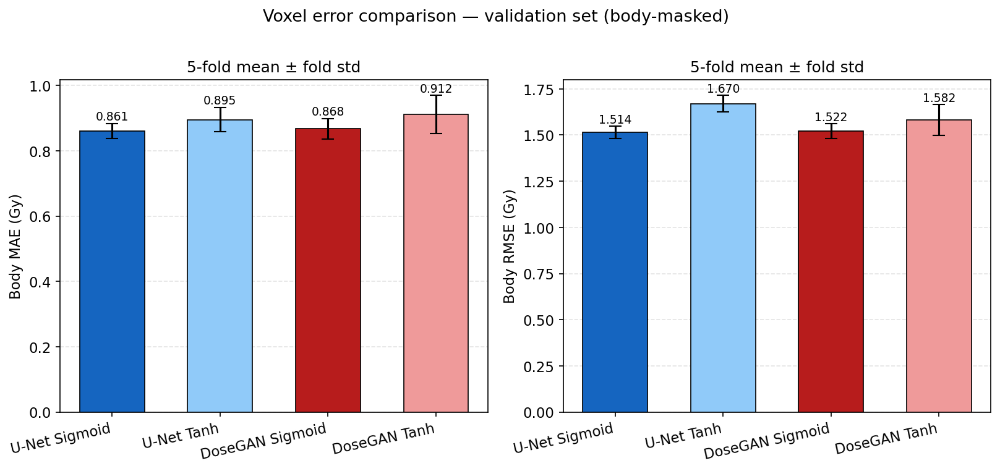
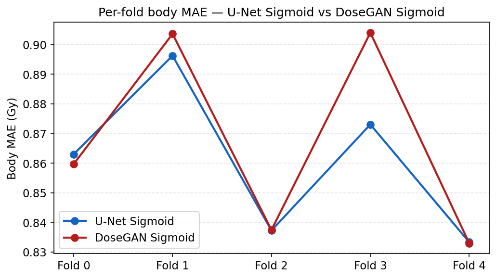
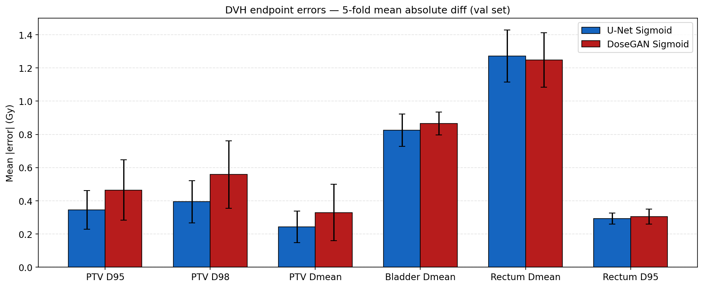
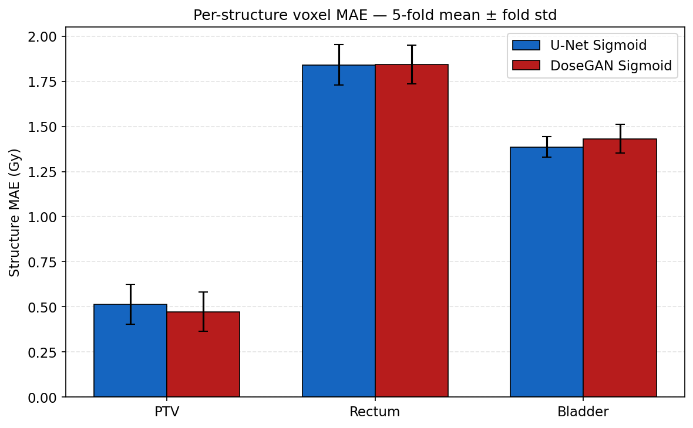
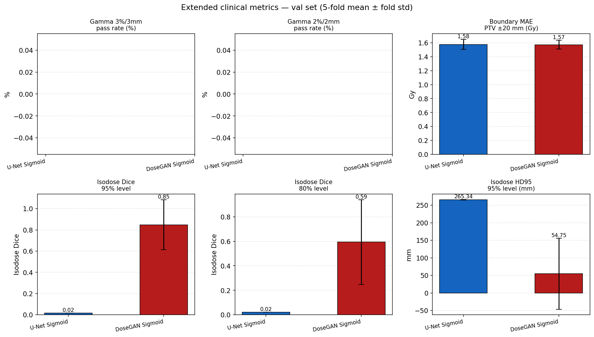

---

## Ablations (fold 0 only unless stated)

| Ablation | U-Net val_L1 | DoseGAN val_L1 | Decision |
|---|---|---|---|
| Sigmoid vs Tanh (5-fold) | 0.0172 ± 0.0005 vs 0.0179 ± 0.0008 | 0.0174 ± 0.0007 vs 0.0182 ± 0.0013 | Sigmoid adopted for both |
| Gradient-magnitude loss λ=1.0 | 0.0174 (+1.2%) | 0.0183 (+4.6%) | Negative — not used |
| BCE vs LSGAN (DoseGAN only) | — | 0.0195 vs 0.0174 | LSGAN retained |

---

## Investigation 1 — Acquisition group robustness (oldAcq vs newAcq)

Mann-Whitney U on body_MAE: **p = 0.923** — no significant mean shift between acquisition groups. However, all 15 worst-MAE patients (top-3 per fold) are from oldAcq (probability < 1.2% under the null), indicating tail-risk concentration rather than a mean effect.

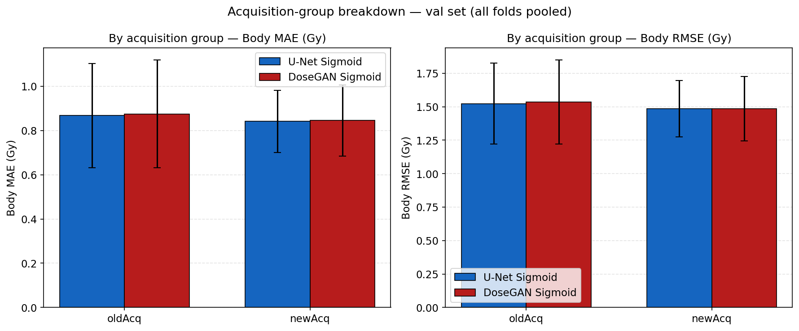
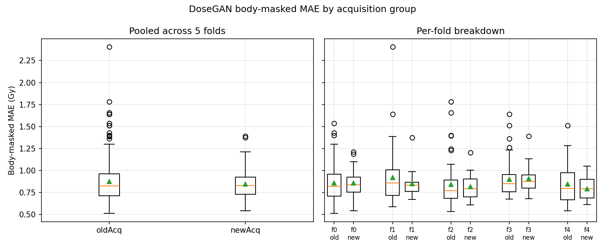
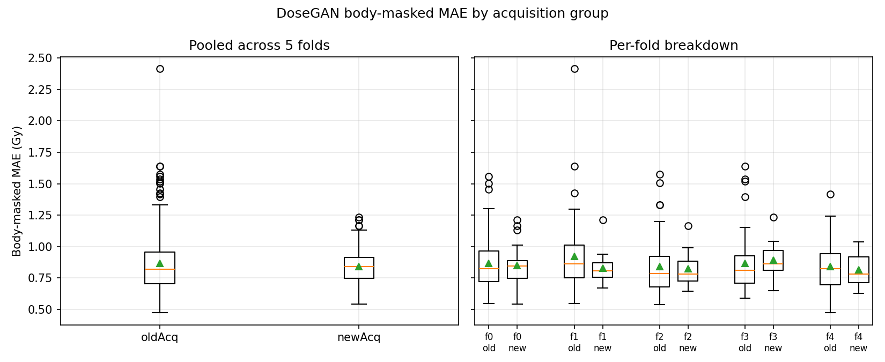

---

## Investigation 2 — Failure mode analysis (worst-case patients)

Dominant failure mode: **bladder under-prediction** (model assigns less dose to bladder than ground truth) combined with **dose-smearing** at structure boundaries. Worst cases concentrated in oldAcq patients (14/15 worst-MAE patients across all folds).

### Dose maps — worst-case patient (fold 0, oldAcq)

| | DoseGAN | U-Net |
|---|---|---|
| **Worst case** | 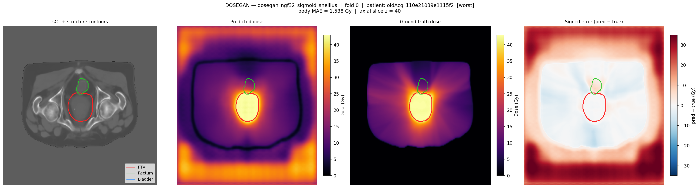 | 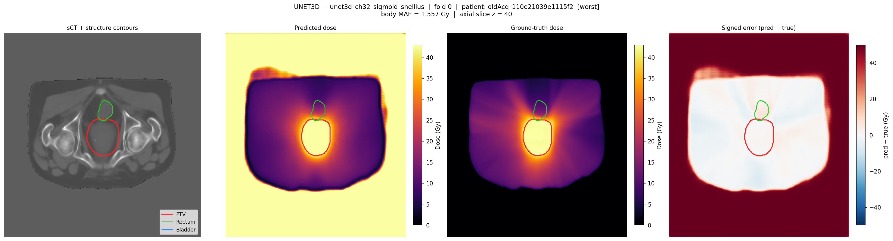 |
| **Median case** | 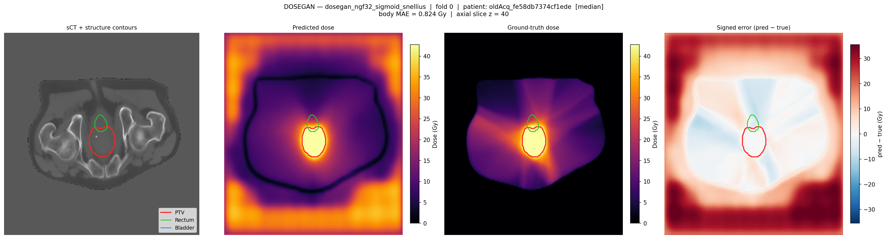 | 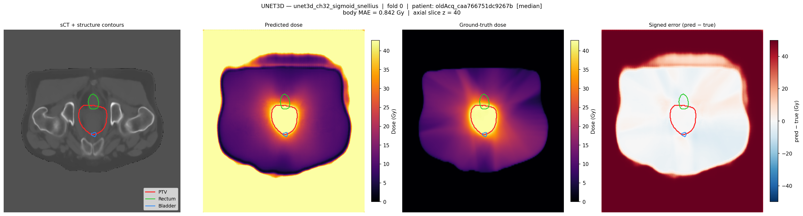 |

---

## SRQ 2 — Geometric channels (14-channel: + 5 spatial encoding channels)

All 4 conditions complete. Full results in `docs/results_validation.md`.

| Metric | U-Net base | U-Net geom | DoseGAN base | DoseGAN geom |
|---|---|---|---|---|
| body_MAE (Gy) | 0.861 ± 0.215 | **0.839 ± 0.190** | 0.868 ± 0.225 | 0.868 ± 0.191 |
| Dice 50iso | 0.043 | 0.041 | 0.240 | **0.733** |
| Dice 100iso | 0.014 | 0.013 | 0.899 | **0.962** |
| HD95 100iso (mm) | 267 | 266 | 50.7 | **1.8** |
| PTV MAE (Gy) | 0.515 | 0.612 | 0.473 | **0.401** |

Key finding: geom channels reduce body MAE for U-Net (−0.022 Gy) but have no effect for DoseGAN. Geom channels dramatically improve DoseGAN spatial accuracy (Dice 50iso: 0.240 → 0.733; HD95 100iso: 51 mm → 1.8 mm). They do not improve U-Net spatial accuracy. The adversarial loss appears necessary to leverage geometric context into accurate dose shape.

---

## SRQ 3 — Clinical relevance (DVH endpoints vs literature)

All values mean |Δ| as % of 50 Gy prescription.

| Metric | U-Net Sigmoid | DoseGAN Sigmoid | Fransson 2024 | Kandalan 2021 |
|---|---|---|---|---|
| PTV/CTV Dmean | **0.49%** ± 0.79% | 0.66% ± 0.76% | 0.7% | 1.0% |
| PTV D95 | **0.69%** ± 1.11% | 0.93% ± 0.83% | 0.7% | **0.4%** |
| Bladder Dmean | 1.65% ± 1.37% | 1.73% ± 1.44% | **0.7%** | 1.8% |
| Rectum Dmean | 2.54% ± 2.03% | 2.50% ± 2.04% | n/r | — |

Gamma pass rate deferred (computationally expensive; run with `--skip-gamma` removed). Test-set evaluation locked until model selection is final.
